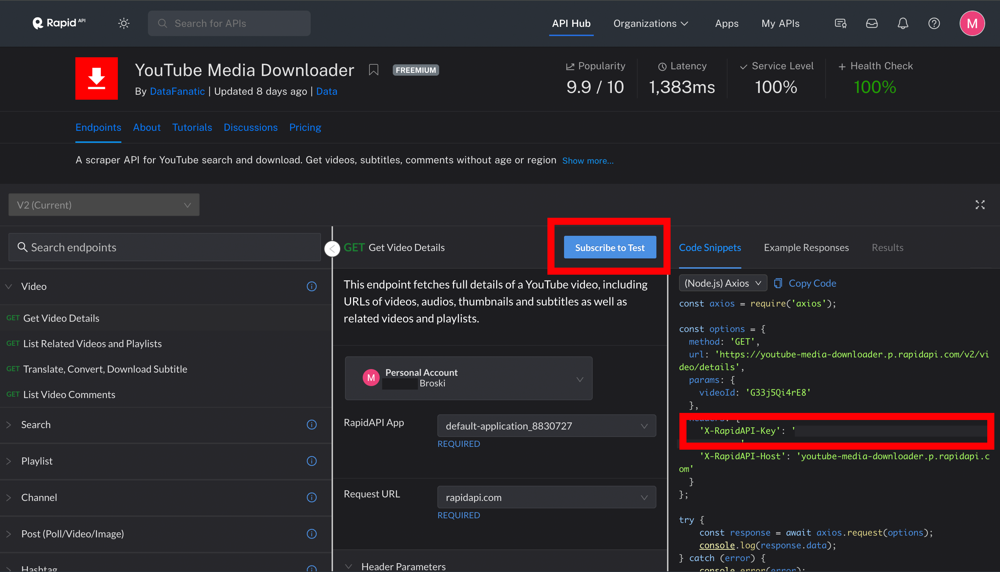
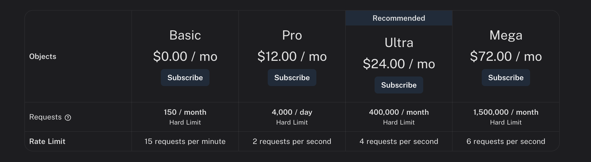
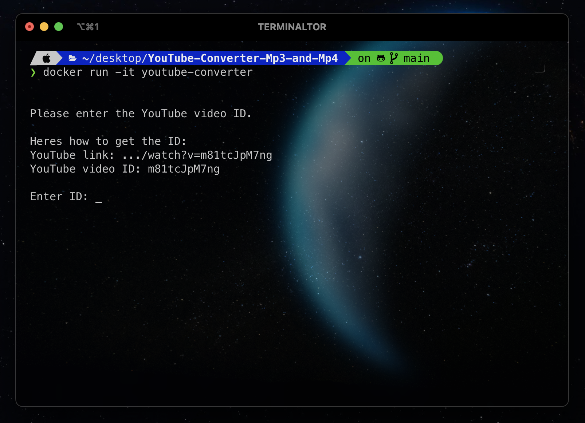

# YouTube-Converter (MP3 and MP4)
This is a simple Python script to convert YouTube videos to MP3 and MP4 via RapidAPI.

---

## How to use

First subscribe to a free plan for the API we're using and get your API key.



Choose a free plan:



---
## Installation

#### Clone the repository:

```bash
git clone https://github.com/br0skiDev/YouTube-Converter-Mp3-and-Mp4.git
```

```bash
# cd into the folder...
cd YouTube-Converter-Mp3-and-Mp4
```

#### Create a .env file in the root directory:

```dotenv
# Your RapidAPI-Key:
X-RapidAPI-Key=
```

#### Continue with Docker:

```bash
# Build the Docker image
docker build -t youtube-converter .
```

```bash
# Run the Docker container
docker run -it youtube-converter
```

#### Or continue with Python:

```bash
# Install the required Python packages
pip install -r requirements.txt
```

```bash
# Run the python script
python main.py  
```

---

Enter the YouTube video ID ( .../watch?v=m81tcJpM7ng -> "m81tcJpM7ng" ) and hit enter.



The MP3 and MP4 files will be saved in the project directory in /output

